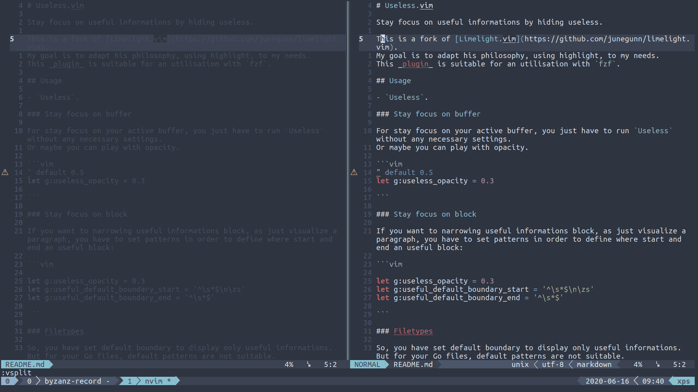

# Useless.vim

Stay focus on useful informations by hiding useless.

This is a fork of [Limelight.vim](https://github.com/junegunn/limelight.vim).
My goal is to adapt his philosophy, using highlight, to my needs.
This _plugin_ is suitable for an utilisation with `fzf`.

## Usage

- `Useless`.

## Default


Stay focused on useful window.

### Stay focus on block

If you want to narrowing useful informations block, as just visualize a paragraph, you have to set patterns in order to define where start and end an useful block:

```vim

let g:useless_opacity = 0.3
let g:useful_default_boundary_start = '^\s*$\n\zs'
let g:useful_default_boundary_end = '^\s*$'

```

### Filetypes

So, you have set default boundary to display only useful informations. But for your Go files, default patterns are not suitable.

```vim

let g:useless_opacity = 0.3
let g:useful_default_boundary_start = '^\s*$\n\zs'
let g:useful_default_boundary_end = '^\s*$'
let g:useful_filetypes = {'go':{'boundary_start':'^\w.*$','boundary_end':'\(^.$\|func.*{.*}$\)'}}

```

### Groups

You'll not define patterns for each filetype that you are using. But you can define groups and apply patterns for a list of filetypes.
I need a group which defines useful informations on paragraph, basically patterns for sentences.


```vim

let g:useless_opacity = 0.3
let g:useful_default_boundary_start = '^\s*$\n\zs'
let g:useful_default_boundary_end = '^\s*$'
let g:useful_groups = {
			\'sentence':{
			\	'filetypes':['markdown','tex'],
			\	'boundary_start':'\(\([.!?#>-]\s\)\@<=.\|\(^\t\)\@<=\w\|^[A-Z0-9]\)',
			\	'boundary_end':'\(\([.!?]\s\)\@=\|\(\n$\)\@=\)'},
			\}
let g:useful_filetypes = {'go':{'boundary_start':'^\w.*$','boundary_end':'\(^.$\|func.*{.*}$\)'}}

```

Oh yeah but for particular files, I just want the basic usage, without patterns for narrowing.

```vim

let g:useless_opacity = 0.3
let g:useful_default_boundary_start = '^\s*$\n\zs'
let g:useful_default_boundary_end = '^\s*$'
let g:useful_groups = {
			\'sentence':{
			\	'filetypes':['markdown','tex'],
			\	'boundary_start':'\(\([.!?#>-]\s\)\@<=.\|\(^\t\)\@<=\w\|^[A-Z0-9]\)',
			\	'boundary_end':'\(\([.!?]\s\)\@=\|\(\n$\)\@=\)'},
			\'basic' : {
			\	'filetypes':['make','yaml'],
			\	'boundary_start':'',
			\	'boundary_end':''},
			\}
let g:useful_filetypes = {'go':{'boundary_start':'^\w.*$','boundary_end':'\(^.$\|func.*{.*}$\)'}}

```

### Overriding patterns
There is rank priority in patterns definition. Default patterns can be override by groups patterns and filetypes patterns.
Groups patterns can be override by filetypes patterns. Filtypes patterns can't be override.

## Options

```vim
" default 0.5
let g:useless_opacity = 0.3

```

### TODO

* [ ] create test
* [x] add priority settings rank
	1. Filetypes
	2. Groups
	3. Default
* [x] write and adapt code for useless_foreground
* [ ] add example for useless_foreground based on filetype, for nerds who change colorsheme
* [ ] add links for vim pattern, in order to know that they are different from `PCRE`
* [ ] add a gif for each example
* [ ] add a gif which show how test pattern
* [ ] improve patterns for markdown
* [x] Feature for keep useful when leaving buffer
* [ ] Add Toggle feature
* [ ] Add HL tested func feature
